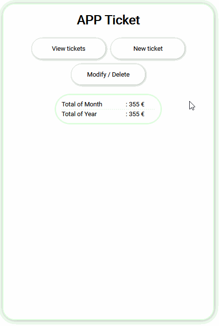

# Tickets_tracker

## Description

Training with PHP - Basic tools for ticket management


## How it work



## Prerequisites

You'll need a working text editor to read this document.

```
VS Code or Atom would work just fine.....
```

## Init DB

```
DROP TABLE IF EXISTS `tickets`;
CREATE TABLE IF NOT EXISTS `tickets` (
  `id` int(11) NOT NULL AUTO_INCREMENT,
  `dating` date NOT NULL,
  `titled` text CHARACTER SET utf8mb4 COLLATE utf8mb4_0900_ai_ci NOT NULL,
  `amount` int(11) NOT NULL,
  UNIQUE KEY `id` (`id`),
  UNIQUE KEY `date` (`dating`)
) ENGINE=MyISAM AUTO_INCREMENT=32 DEFAULT CHARSET=utf8mb4 COLLATE=utf8mb4_0900_ai_ci;
```

## Built with

- [HTML5](https://developer.mozilla.org/es/docs/HTML/HTML5)
- [CSS3](https://developer.mozilla.org/en-US/docs/Archive/CSS3)
- [PHP](https://www.php.net/)
- [MySQL](https://www.mysql.com/fr/)

